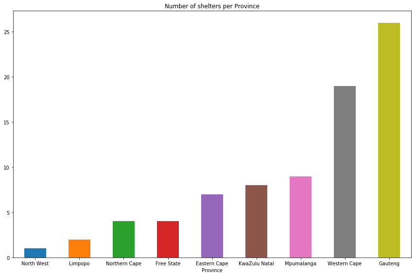
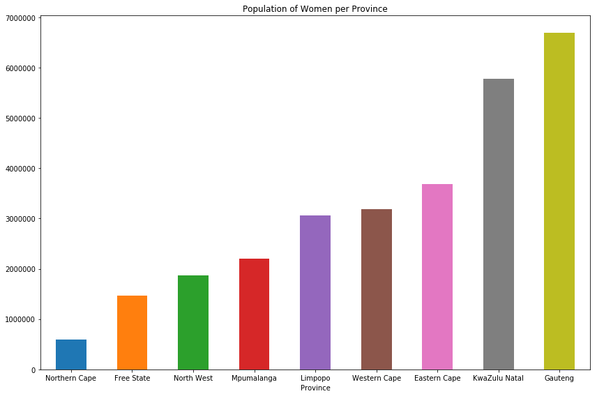

# Seeking Shelter

**A project that focuses on shelters and services aimed at women that are victims of abuse. It aims to map shelters across South Africa and to combine this with a mapping of other support services.**

Research by The Heinrich Böll Foundation claims that even though the Domestic Violence Act says that police are obligated to refer women to shelters, a lot of police personnel do not know where these services are. 

The outcomes of this project is to dynamically generate area-specific maps that can be downloaded and printed as posters. The intent is for these posters to be put up at police stations, public services and be used for advocacy purposes by organisations like The Heinrich Böll Foundation.

## Contact
Please contact Kirsten Pearson (kirstenpea@gmail.com) or Lailah Ryklief (https://github.com/lailahr) if you want to learn more about this project or get involved.

## interactive map
Go to: (https://colinanthony.github.io/seeking-shelter/)

## Charts

## Resources
- [Google sheets Data Gathered](https://docs.google.com/spreadsheets/d/16QnoXu2MDsbSpIE6H52mYsLbXZdmieqgsean8i_3RlA/edit#gid=590324052)

## Contributors
- Colin Anthony (https://github.com/ColinAnthony)
- Alex Steinberg (https://github.com/alex-steinberg)
- Waheeb Aghers
- Francois Buys (https://github.com/buys-fran)
- Alicia de Wet
